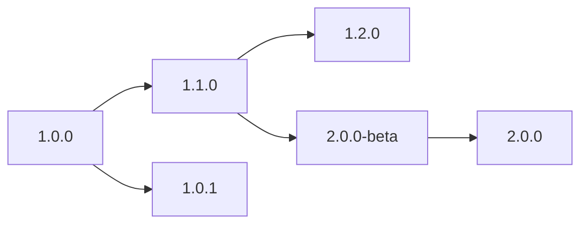

## Overview

Versions in Unlingo are containers that hold different iterations of your translations within a namespace. They allow you to organize your translations across different stages of development, maintain multiple versions of your product, and safely manage updates to your content.

Think of versions as branches in version control - each version represents a specific state of your translations that can evolve independently.

## Key Concepts

### Version Structure

Each version contains:

- **Languages**: Multiple language translations
- **Schema**: Content schema for auto syncs
- **Metadata**: Creation time, update history
- **Version Number**: Human-readable identifier

### Version Naming

Versions support flexible naming conventions:

- **Semantic Versioning**: `1.0.0`, `2.1.3`, `1.0.0-beta`
- **Branch Names**: `main`, `develop`, `feature-branch`
- **Environment Names**: `production`, `staging`, `dev`
- **Custom Names**: `winter-release`, `mobile-v1`

## Creating Versions

### New Version

Create a completely new version with no existing content:

1. Navigate to your namespace
2. Click **Create Version**
3. Enter a version number (e.g., `1.0.0`)
4. Leave copy option empty
5. Click **Create Version**

### Copy from Existing Version

Create a new version by copying content from an existing version:

1. Navigate to your namespace
2. Click **Create Version**
3. Enter new version number (e.g., `1.1.0`)
4. Select **Copy from existing version**
5. Choose the source version to copy from
6. Click **Create Version**

<Tip>
    Copying from an existing version includes all languages and translations, giving you a complete starting point for
    your new version.
</Tip>

## Version Management

### Editing Versions

You can update version names and metadata:

1. Click the **⋮** menu on a version card
2. Select **Edit Version**
3. Update the version name
4. Save changes

<Warning>Changing version names might break existing releases or API integrations that reference the old name.</Warning>

### Deleting Versions

To delete a version:

1. Click the **⋮** menu on a version card
2. Select **Edit Version**
3. Click **Delete Version**
4. Confirm the deletion

<Danger>
Deleting a version permanently removes:
- All languages in that version
- All translation data
- Version history and metadata
- Version schema

This action cannot be undone.

</Danger>

## Working with Versions

### Version Workflow

A typical version workflow might look like:

1. **Start with base version**: `1.0.0` with core translations
2. **Create feature versions**: `1.1.0` with new features
3. **Maintain patches**: `1.0.1` for critical fixes
4. **Develop major versions**: `2.0.0-beta` for major changes

<Info>
    Version are not connected between each other. They are independent units that can be used for different purposes.
</Info>

### Version Limits

Each workspace has limits on versions per namespace:

- **Free Plan**: 5 versions per namespace
- **Pro Plan**: 20 versions per namespace
- **Enterprise**: Custom quotas

<Info>
    Monitor your version usage in the namespace header. When approaching limits, consider cleaning up old versions or
    upgrading your plan.
</Info>

## Troubleshooting

<AccordionGroup>
    <Accordion title='Version limit reached'>
        - **Problem**: 
          - Cannot create new versions due to workspace limits. 
        - **Solutions**: 
          - Delete unused old versions 
          - Upgrade workspace plan 
    </Accordion>

    <Accordion title='Version name conflicts'>
        - **Problem**:
          - Version name already exists.
        - **Solutions**:
          - Use different naming convention
          - Add suffix like `-v2` or `-new`
          - Delete conflicting version if no longer needed
          - Use semantic versioning to avoid conflicts
    </Accordion>

    <Accordion title='Missing translations after copy'>
        - **Problem**:
          - Not all translations copied to new version.
        - **Solutions**:
          - Ensure source version has all expected languages
          - Check if copy operation completed successfully
          - Verify workspace permissions
          - Copy individual languages manually if needed
    </Accordion>

    <Accordion title='API version not found'>
        - **Problem**:
          - API returns error for version.
        - **Solutions**:
          - Verify version exists in namespace
          - Check version name spelling
          - Ensure API key has access to namespace
    </Accordion>

</AccordionGroup>

## Next Steps

<CardGroup cols={2}>
    <Card title='Releases' icon='rocket' href='/concepts/releases'>
        Understand how to publish versions as releases
    </Card>
    <Card title='Translations' icon='text' href='/concepts/translations'>
        Deep dive into translation management
    </Card>
</CardGroup>
